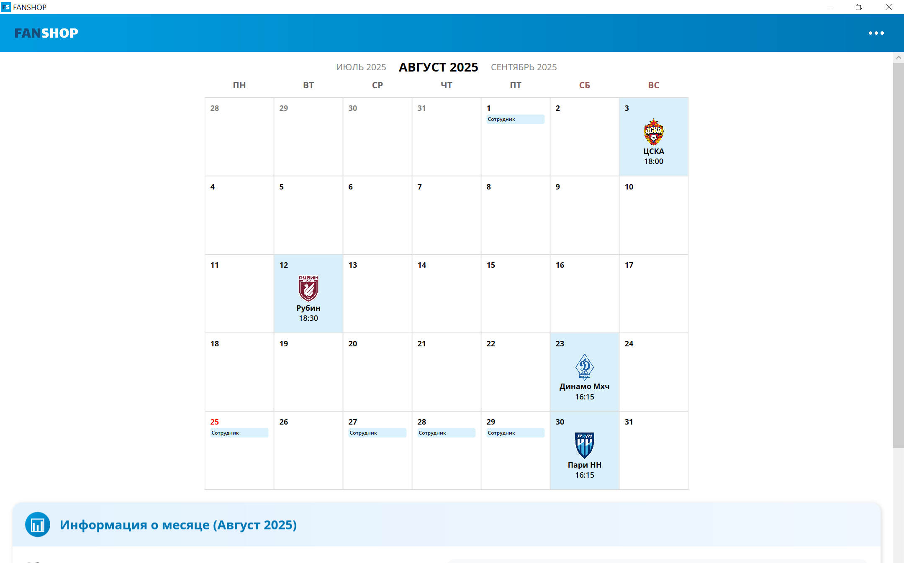
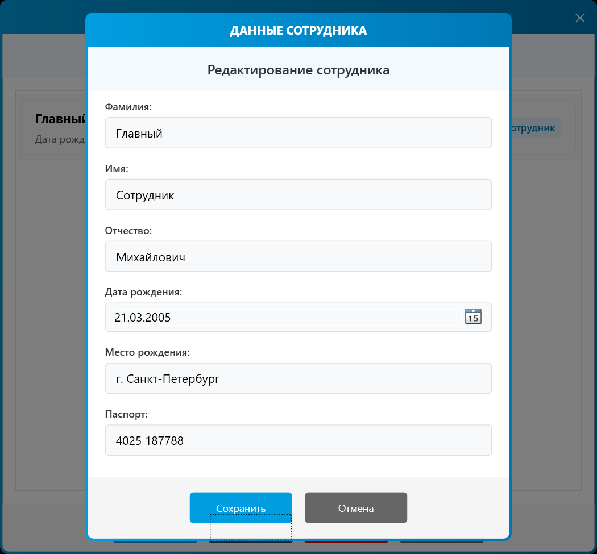
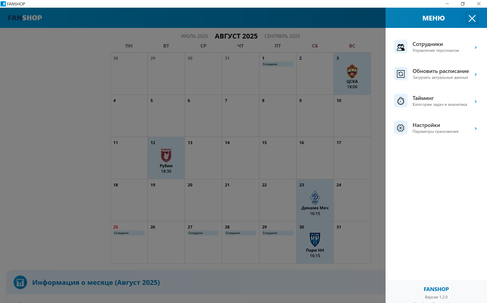
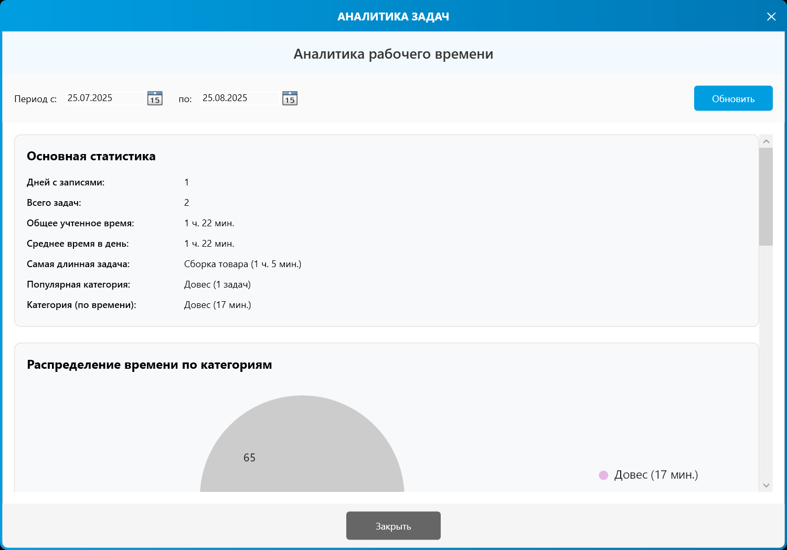
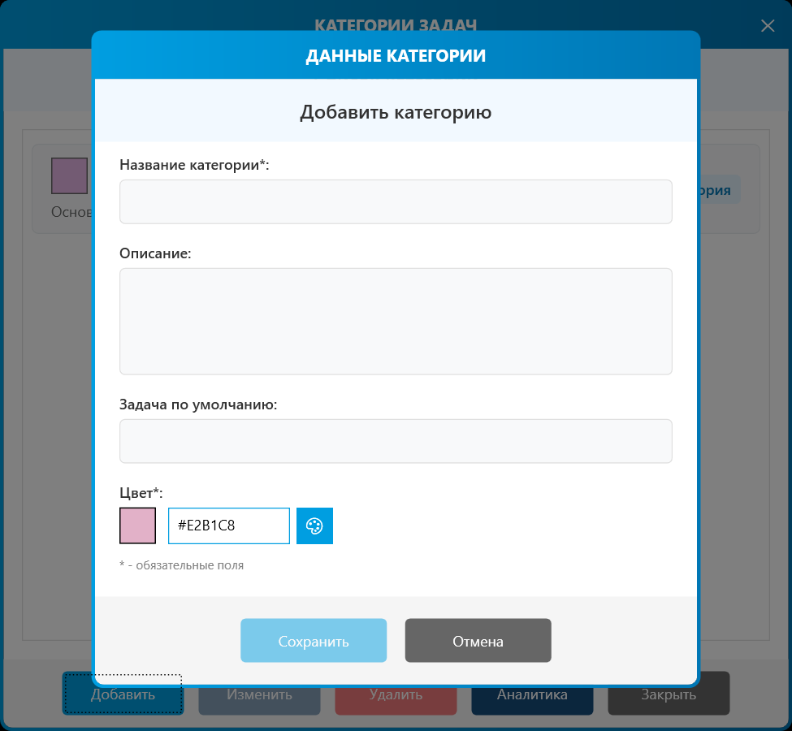

# FanShop — WPF Application for Matchday and Shift Management

**FanShop Calendar** is a desktop WPF application developed for managing the day-to-day operations of the **Zenit Football Club's FanShop**. It provides tools for scheduling matches, assigning employee shifts, calculating payroll, printing access passes, and more.

---

## Features

- 📅 **Matchday Calendar**
    - Displays upcoming Zenit FC matches
    - Assigns employee shifts to specific matches
    - Interactive calendar view with date/event filtering

- 👥 **Employee Shift Management**
    - Assign employees to work shifts
    - Tracks total worked hours and shift counts

- 💵 **Automated Payroll Calculation**
    - Calculates salaries based on shifts.
    - Exports payroll reports

- 🖨️ **Pass Printing**
    - Generates printable Word (DOCX) access passes
    - Customizable templates and fields

- ⚙️ **Flexible Settings**
    - Manage employee roles, shift rules, and payroll settings
    - Import/export data for backup or transfer

- 📊 **Analytics and Reporting**
    - View statistics on wor days and hours worked
    - Make visual charts for better insights

---

## UI Preview











---

## Installation

1. Make sure you have [.NET 8.0 SDK](https://dotnet.microsoft.com/download/dotnet/8.0) or later installed.
2. Clone the repository:

   ```bash
   git clone https://github.com/kihort-si/FanShop.git
3. Open the solution in Visual Studio 2022+ 
4. Build and run the application

## Dependencies
- .NET 8.0
- WPF (Windows Presentation Foundation) — for the UI 
- OpenXML SDK — for working with Word documents 
- Entity Framework Core — for database interaction (SQLite)
- Firebase — for cloud storage
- LiveCharts2 — for data visualization

## Project Structure
```plaintext
FanShopCalendar/
├── Models/              # Data models (Employee, Shift, Match, etc.)
├── ViewModels/          # ViewModel classes for the UI
├── Views/               # XAML UI files
├── Windows/             # Windows for different application features
├── Controls/            # Custom user controls
├── Converters/          # Converters for data binding
├── Services/            # Business logic (payroll, pass generation, DB access)
├── Resources/           # Icons, templates, styles
├── MainWindow.xaml      # Main application window
└── App.xaml             # Entry point
```

## License
This project is licensed under the [MIT License](https://github.com/kihort-si/FanShop/blob/master/LICENSE).

## Acknowledgements
- To Zenit FC for the inspiration 
- To the development team for their effort 
- To users for feedback and support

## Feedback & Issues
Found a bug? Have an idea? Open an issue or submit a Pull Request. Use the [Contributing guidelines](https://github.com/kihort-si/FanShop/blob/master/CONTRIBUTING.md) in the repository.

⚽ Built with a love for football and clean desktop apps.
